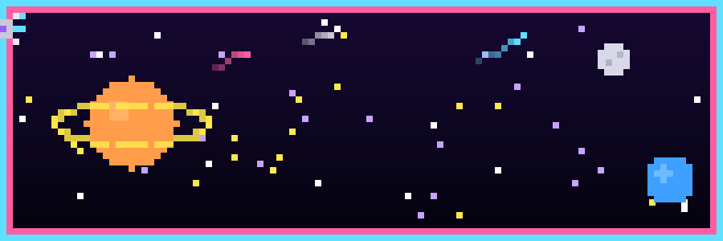

 

  

  

 

  

 

  

 

<!-- Generated by .github/workflows/activity.yml from live GraphQL contribution data — see setup note below -->

  

 

<!-- Requires the snk GitHub Action — see setup note below -->

  

 

  

 

`> INSERT COIN TO CONTINUE`

